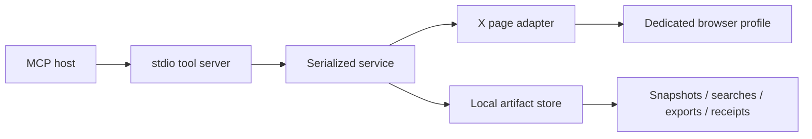

# Architecture

- `src/server.ts` declares the MCP contract, annotations, prompt, resource, and error envelopes.
- `src/service.ts` serializes browser work and owns saved-search baselines and prepared-action lifecycle.
- `src/browser.ts` manages browser ownership, detects page state, navigates, and performs verified actions. Its injected launcher allows fully intercepted browser tests.
- `src/dom.ts` contains self-contained extraction functions serialized into the browser. They inspect rendered DOM, not internal API payloads or cookies.
- `src/collector.ts` handles deduplication, virtualized lists, collection budgets, and stop reasons.
- `src/store.ts` stores local JSON artifacts and exports with path containment and atomic JSON replacement.
- `src/validation.ts` normalizes bounded tool inputs and constructs supported X destinations.
- `src/config.ts` reads explicit process configuration; `src/cli.ts` handles server, login, diagnostic, and one-shot search commands.

## Action lifecycle

`normalize → verify account → read target preview → verify account again → prepare ID`

`execute ID → check opt-in/expiry/account → consume ID → persist started receipt → recheck account in adapter → click → verify visible outcome → persist final receipt`

IDs are held in memory, expire after ten minutes, and do not survive a restart. Receipts persist. A crash after clicking can leave a `started` receipt, so no automatic retry is permitted. Posts require an X success toast; toggles require the inverse control to appear. A client must obtain the user's authorization before execution. The server cannot prove that a human actually approved a tool call.

Navigation and account checks cannot prevent a human switching accounts in the few milliseconds between a check and click. Do not manually change the active account while an action is executing. Use separate dedicated profiles for different accounts.

## Browser ownership

The default session owns its persistent context and closes that context on shutdown. CDP mode borrows a context but owns only the new tab it creates. Closing a CDP session closes that tab and leaves the user's browser open; the process exit releases the debugging connection. Concurrent processes sharing one persistent profile are unsupported.

## Research semantics

Every successful collection gets a snapshot UUID. The source key includes the selected timeline tab, so Following and For you snapshots are not treated as equivalent. Empty or blocked saved-search runs are saved for inspection but do not advance the comparison baseline. Replacing a saved-search definition clears its baseline.

Snapshots are bounded observations. `notObserved` is deliberately not called deleted. Record identity comes from original post IDs, account handles, or hashes of visible card text/links; notification/trend hashes are heuristic and changing text can create a new record.

## Extension boundaries

Add a browser capability by defining its validated input, adapter operation, public tool, and fixture test. New writes must use the prepared-action lifecycle. No general `evaluate`, arbitrary URL, arbitrary filesystem path, cookie export, or raw click tool is exposed to the MCP host. DOM selectors and account identity are the principal live compatibility risks.
